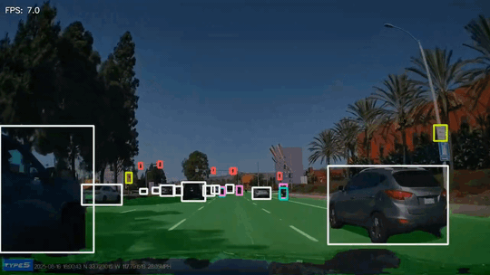

## Demo

## Demo

<p align="center">
  
</p>

# Real-Time Road Scene Understanding for Autonomous Driving

An end-to-end computer vision pipeline for autonomous driving that combines semantic segmentation, object detection, and multi-object tracking into a unified real-time perception system.

The project is built using the **BDD100K** dataset and integrates **U-Net++**, **YOLO11m**, and **ByteTrack** for road scene understanding.

---

## Project Overview

The system performs:

- Semantic segmentation of road scenes
- Object detection
- Multi-object tracking
- Real-time video inference
- FPS monitoring

---

## Architecture

```
                   Input Video
                        │
        ┌───────────────┴───────────────┐
        │                               │
        ▼                               ▼
 Semantic Segmentation            Object Detection
     (U-Net++)                     (YOLO11m)
        │                               │
        ▼                               ▼
 Road Segmentation Mask         Bounding Boxes
                                        │
                                        ▼
                                ByteTrack Tracker
                                        │
        └───────────────┬───────────────┘
                        ▼
            Visualization & Overlay
                        │
                        ▼
              Annotated Output Video
```

---

## Repository Structure

```
├── detect-drive.py
├── segment-drive.py
├── Main.py
├── yolo_best.pt
├── unetpp_effb3.pth
├── output_video.mp4
├── README.md
```

---

## Dataset

This project uses the **BDD100K (Berkeley DeepDrive 100K)** autonomous driving dataset.

Official Website: https://bdd-data.berkeley.edu/

---

## Models

### Semantic Segmentation

| Component | Value |
|----------|-------|
| Model | U-Net++ |
| Encoder | EfficientNet-B3 |
| Framework | Segmentation Models PyTorch |
| Classes | 19 |
| Loss | Dice Loss + Cross Entropy Loss |
| Optimizer | AdamW |
| Metric | Mean IoU |

### Object Detection

| Component | Value |
|----------|-------|
| Model | YOLO11m |
| Framework | Ultralytics |
| Classes | 10 |
| Optimizer | AdamW |
| Tracker | ByteTrack |

---

## Performance

### Semantic Segmentation

| Metric | Score |
|---------|------:|
| Train mIoU | **61.17%** |
| Validation mIoU | **50.20%** |

### Object Detection

| Metric | Score |
|---------|------:|
| mAP@0.5 | **57.3%** |
| mAP@0.5:0.95 | **32.8%** |

---

## Technologies

- Python
- PyTorch
- Segmentation Models PyTorch
- Ultralytics YOLO11
- OpenCV
- Albumentations
- NumPy
- ByteTrack
- tqdm

---

## Installation

```bash
git clone https://github.com/AkhundMubeen/autonomous-driving-perception.git

cd real-time-road-scene-understanding

pip install -r requirements.txt
```

---

## Usage

```bash
python Main.py
```

---

## Future Work

- Lane detection
- Instance segmentation
- Depth estimation

---

## License

This project is released for educational and research purposes.

---

## Author

**Mubeen Akhund**

Software Engineering Undergraduate  
Mehran University of Engineering & Technology (MUET)

GitHub: https://github.com/AkhundMubeen
